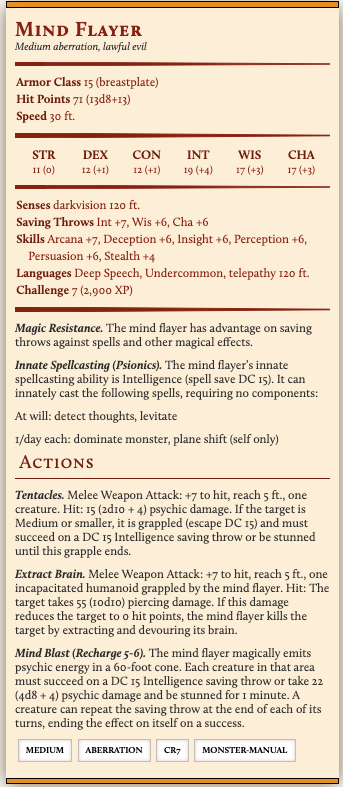

# Text Generation Using RNNs for D&D Applications

This project uses deep learning to generate text useful in creating characters for
Dungeons and Dragons roleplaying adventures. For those with little background in
roleplaying, novelty is absolutely key to enjoyable adventures for experienced 
and beginning players alike. This project created models using LSTM and
GRU memory units as well as other facets of recurrent neural network architecture.
The dataset used to train the models is the entire set of monster characters from
Dungeons and Dragons 5th edition. The characters were transformed into text and 
all where concatenated, then batched in order to make over a million data points
for training. A wrapper class was created for ease of workflow and iteration
during training, and it <a href='Models/textGen.py'>can be accessed here.</a>

A jupyter notebook that will showcase the workflow using the text generators is
currently underconstruction, but will be uploaded soon.

As you may have guessed, my own interest and experience in roleplaying games is 
the inspiration behind this project, besides my desire to use deep learning for
natural language processing and data science. That makes this a bit of a passion
project, however I will argue that passion projects are some of the best to get
your hands dirty and your head wrapped around a difficult concept!

I would be remiss in not saying that the initial inspiration for this project 
came from
<a href='https://aiweirdness.com/post/165373096197/a-neural-network-learns-to-create-better-dd'>
an aiweirdness.com post</a> on using neural networks to generate the names for 
novel D&D spells. They were on to something, and this work is an effort to extend
their insight.

## Methods and Tools

Python's Scrapy library was used to acquire all the monster descriptions for the
5th edition (current) of Dungeons and Dragons. <a href='scraping/monsters'>You can access that spider here.</a> 
Then the Tensorflow and Keras libraries were used to build RNNs, using LSTMs and 
GRUs to auto-generate text that closely mimics D&D monsters. The end products are
useful python classes for text generation and models that can create 
novel monsters for Dungeons and Dragons adventures.

The initial approach has been to generate new monsters using models that generate
text descriptions one ASCII character at a time. However, I will also plan to 
test sentence level models and potentially even use transformers.

## Analysis

The typical Dungeons and Dragons monster has a detailed description of both what
it is and what it is capable of doing within the game. This description is known
as a statblock. Each statblock entails the statistics that the monster has in the
form of integer attributes as well as text descriptions. For example, here is the
statblock for a Mind Flayer (fans of the Netflix show Stranger Things will be 
familiar!)

As you can see, the statblock has a relatively varied structure with many different
norms for how characters are used. The initial approach taken in this project was
to take the information from each statblock and create a representative text string
and use that as training data for a recurrent neural network model. The hope being
that the latent structure of D&D statblocks across all monsters would be enough 
to train a model to generalize and create new statblocks that made sense.

## External Links

<a href='https://www.tensorflow.org/beta/tutorials/text/text_generation'>Tensorflow Text Generation with an RNN</a>: a 
helpful walkthrough on the tensorflow site to accomplish character level text generation.
